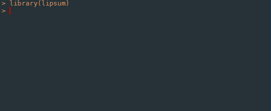

lipsum
======

An R package for generating paragraphs of lorem ipsum.

install
-------

You can install the package using `devtools`:

``` r
devtools::install_github("aakosm/ipsum")
```

how it works
------------

The package has only one function right now, `lipsum()`, which will generate you n paragraphs of lorem ipsum, saving you precious seconds of internet search and leaving R.


